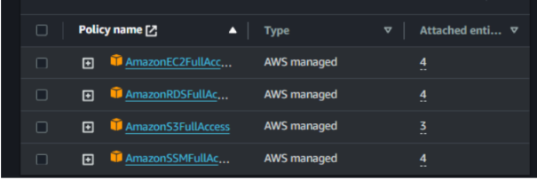

# Despliegue de una arquitectura altamente disponible y escalable en AWS. 
Despliegue de una arquitectura altamente disponible y escalable en AWS. 

## Planificación

### Requerimientos
#### Funcionales
*  Desarrollar la plataforma web que permita a los clientes explorar los diferentes libros.
*  Se debe configurar toda la plataforma en una región y en este caso se trata de la region de North Virginia
*  se configura una VPC (IP 172.16.0.0/16) en donde se montaran las diferentes instancias, subredes y servicios
*  Deben existir dos zonas de disponibilidad A (us-east-1a) y B (us-east-1b)con una subred pública y dos subredes privadas cada una.
*  Crear las siguientes subredes:
*  PublicSubnetA:172.16.1.0/24
*  PrivateSubnetA: 172.16.3.0/24 (donde se aloja el Servidor Web WS)
*  PrivateSubnetAA 172.16.5.0/24 (donde se aloja la Base de datos RDS)
*
*  PublicSubnetB:172.16.2.0/24
*  PrivateSubnetB: 172.16.4.0/24 (donde se aloja el Servidor Web WS)
*  PrivateSubnetBB2.16.6.0/24 (donde se aloja la Base de datos RDS)
*
* Crear un Internet Gateway para darle conexión a internet a nuestra VPC --> IG_WSC
*
* Crear en cada zona de disponiblidad el Nat Getway para conectar la subred publica con la subred privada
* La pagina WEB conecta la subred privadaA con subreg privada AA ( base de datos )
* Se debe configurar un Auto Scaling para tener una alta disponibilidad del servicio WEB entre las subredes privadas A y B
*
* Se debe configurar un Aplication Load Balancer para distribuir las cargas entre los diferentes zonas de disponibilidad y el cual que permite el ingreso de los usuarios a travez del Nat GetWay directamente a la pagina web
*
* Se deben configurar varios Segurity Groups para permitir accesos a las diferentes partes del sistema utilizando diferentes puertos de comunicación
* Segurity groups para Acceso de Usuarios a la Pagina Web sg-book-ws (Instancias de los WEB SERVER) Reglas: TCP 22 y TCP 5000
*
* Segurity groups para Acceso de Administradores a la Base de datos sg-db (Base de Datos RDS) Reglas:  TCP 22 y TCP 3306
*
*
* La instancia EC2 debe poder conectarse a la base de datos en la subred privada. Para facilitar esta conexión se implementarán parámetros de conexión de la base de datos en el AWS System Manager Parameter Store, garantizando acceso seguro y eficiente a los datos almacenados.
*
*
#### NO Funcionales
*
* La pagina Esta desarrollada en python mediante el framework Flask
* El motor de base de datos de nuestro servidor web es mariadb
*
*  
### Diagrama (Arquitectura)

En la siguiente imagen se muestra el diseño de la arquitectura a partir de los requerimientos. 


### Diagrama Grant

En la siguiente imagenes se muestran el diagrama grant y define los tiempos de ejecución del proyecto. 


### Diagrama Roles

En la siguiente imagenes se muestra la tabla roles para acceder a los servicios del sistema


#### ESTIMADO COSTOS
*
En la siguiente imagenes se muestra el estimado de los costos y se indican los diferentes servicios que se utilizan:


La documentación completa se encuentra en el archivo [Docs/EstimadoCostoAWS.pdf](https://github.com/jfgarra/TalentoTech-G2/blob/main/Docs/EstimadoCostoAWS.pdf).

#### PASOS PRINCIPALES PARA LA INSTALACION DE LA PLATAFORMA
* Partimos de las plantilla que conforman la infraestructura en donde esta todo el código requerido:
*  Archivos YML:
*    Application.yml [application.yml](https://github.com/jfgarra/TalentoTech-G2/blob/main/Code/application.yml).
*    network.yml [network.yml](https://github.com/jfgarra/TalentoTech-G2/blob/main/Code/network.yml).
*
*    Se debe crear un ambiente en aws Cloud9
*  Abrir los archivos .yml dentro de la instancia Cloud9
- paso 1
- ```aws codecommit create-repository --repository-name infraestructura-aws --repository-description "crear infraestructura en aws"```
- Paso 2
- ```aws codecommit get-repository --repository-name infraestructura-aws```
- Paso 3
- ```aws codecommit get-repository --repository-name infraestructura-aws```
- Paso 4  Ahora se clona el repositorio, para obtener la carpeta a trabajar
- ```git clone https://git-codecommit.us-east-1.amazonaws.com/v1/repos/infraestructura-aws```
- Paso 5
- Creo el archivo network.yml con las configuraciones que ya teníamos del proyecto
pasado. Cuando trabajamos con infraestructura como código.
- Paso 6 Validación del Template
- ```aws cloudformation validate-template --template-body file://network.yml```
- Paso 7
- Realizamos el push al repositorio (add. , git commit, git push)
- ```git push codecommit::us-east-1://infraestructura-aws```
- Paso 8
- Configuramos el pipeline, en aws es codePipeline. Esto con el fin de que si se da un
push, la infraestructura se desplegará automáticamente.

- Paso 9
- items que se deben seleccionar: fuente del pipeline y seleccionamos codecommit
El nombre del repositorio y La rama
- Se muestran las ventanas de la creacion del Pipeline


- Se requiere el nombre del stack que aparece en archivo application.yml "aws-stack"
- 10 Pasos para el Deploy (verificar ajuste)


- AWS Cloudformation
- La región
- Create or update a stack
- Stack name: Según cómo esté configurado en el template, como el archivo base se
llamó "aws-stack" se utiliza este nombre.
-


- más abajo se pedirá un rol por lo que tendremos que crearlo.


-Creacion de un Role llamado RolePipeline
- los Servicios:

- 
- Se selecciona en la creación del Pipeline el role creado
- 


- ya quedó configurado y se dá "Create"


 -
 -
 Se debe configurar el System Manager el cual es un servicio AWS Con el fin de gestionar y almacenar los datos de configuracion y acceso a la base de datos
 - Continuacion se presentan las imagenes con la información del parameter Store:
 - 
   

   

   
 
   
 
   

 Es necesario crear un roll en el servicio AWS IAM el cuarl tiene las siguientes politicas:

  
 -
 Este rol se ubicara en el template de application.yml y se sustituira en cada uno de los parametros que contengan lo siguiente:
IamInstanceProfile: 
          Name: ec2RoleWs

  Se realiza el mismo paso en el PipeLine         
 


*  Validar los templates en la consola (ver que no hay errores de sintaxis)
*    Comando: aws cloudformation validate-template --template-body file://aws-stack.yml
*  Ejecutar la creación de la infraestructura utilizando los servicios de cloudformation
*    Comando: aws cloudformation create-stack --stack-name aws-stack --template-body file://aws-stack.yml

*   Almacenar los templates en el servicio codecommit

*   Configurar el Pipeline

*   verificar si se realiza el despliegue de la infraestructura
*      Utilizando browser

*  realizar monitoreo para ver como se comporta la aplicacción  


#### PASO a Detallado PARA LA INSTALACION DE LA PLATAFORMA
#### PRUEBA PASO A PASO ARCHIVO .DOC
*
LINK ARCHIVO .DOC
La documentación completa se encuentra en el archivo [Docs/CreaInstancia_DB.pdf](https://github.com/jfgarra/TalentoTech-G2/blob/main/Docs/CreaInstancia_DB.pdf).

#### PRUEBA PASO A PASO ARCHIVO .DOC
*
